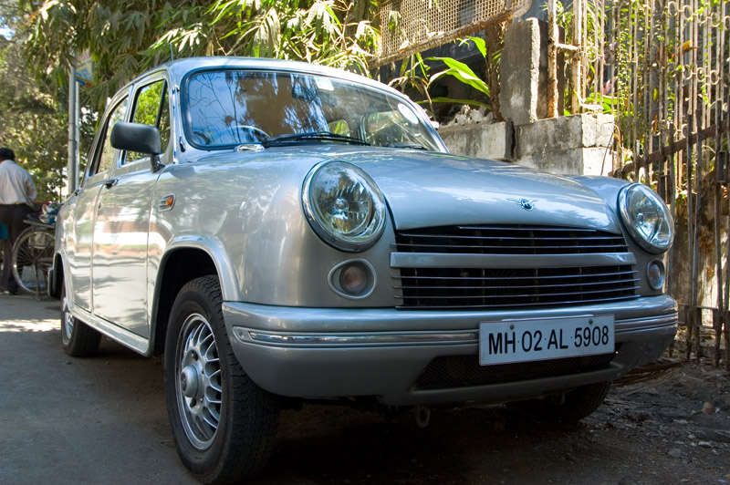
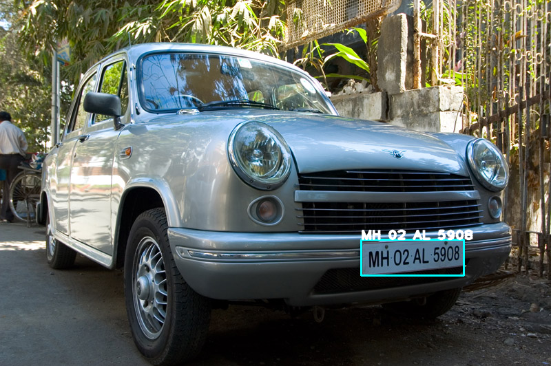
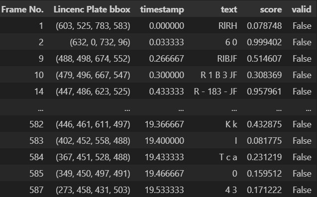

# Automatic number plate recognition using YOLO v8 and easyOCR
This project implements Automatic Number Plate Recognition using YOLOv8 for license plate detection and EasyOCR for text extraction.
It processes images or videos, detects number plates in real time, and recognizes alphanumeric text efficiently.
Ideal for smart parking, traffic monitoring, and security applications.
<!-- no need sort.py but check once -->

 
## Dataset
- images
    - [Indian license plate (small set)](https://www.kaggle.com/datasets/saisirishan/indian-vehicle-dataset?select=State-wise_OLX)
    - [Indian license plate (large set)](https://www.kaggle.com/datasets/gauravsanwal/indian-license-plate)          
    <!--downloaded in Dataset folder in D drive-->
- Videos
    - [sample european car showcase](./dataset/video/demo.mp4) 
    - [sample Indian number plate (augmented)](./dataset/video/IND_demo.mp4) 
    <!-- - [traffic video](https://www.youtube.com/watch?v=MNn9qKG2UFI&list=PLcQZGj9lFR7y5WikozDSrdk6UCtAnM9mB) -->

## Train YOLO V8
- to train YOLO models we have to prepare the dataset set in a specific format like .yaml or dataloader. here I'm using [`IN_NP_large_set.yaml`](./dataset/IN_NP_large_set.yaml) 
- to start training create a instance of model and use `model.train(**args)` to begin training. [train.ipynb](./Model/train.ipynb) for training reference
- adjust the epochs, batches, num workers, devices to Fine Tune the model. default parameter which i have used are listed below

|parameters|value|
|:-:|:-:|
|Dataset|Indian license plate (large set)|
|epochs|50|
|Device|CUDA (GPU)|
|image size|640 x 640|

## Inference On YOLO V8
after performing inference on image and video sample set it showed average accuracy about 89%-96% for images and 76%-89% for videos
### Infernece on Image

|||
|:-:|:-:|
|Orignal Test Image|Image after Infernece|

### inference on Video
|||
|:-:|:-:|
|Orignal Test Video|Video after Infernece|

## OCR using EasyOCR
EasyOCR is a Python library for Optical Character Recognition (OCR) – it extracts text from images easily using deep learning models. it a 2 stage text recognition pipeline. where **CRAFT (Character Region Awareness for Text Detection)** is used for text detection and  **CRNN (Convolutional Recurrent Neural Network)** is used for text recognition. here we using it for text extraction from number plate.
|||
|:-:|:-:|
|Orignal|Final|

|||
|:-:|:-:|
|Orignal (Augmented)|Final|

the color changing effect of bounding box indicates that the number plate which has been extracted is in correct format (as per indian number plate).

## Saving detection into CSV format
the quick change of characters in prediction makes it difficult to predicts and record the correct number plate. so we are also saving prediction into CSV format with time stramp and its info.

## Future work
- integrate object tracking using SORT (simple online and realtime tracking algorithm) [refernce:  [https://github.com/abewley/sort](https://github.com/abewley/sort)]